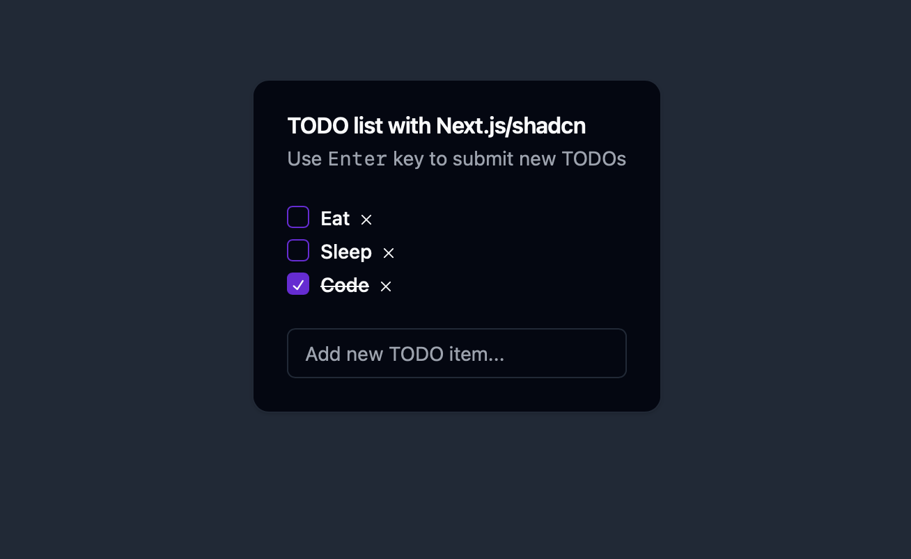

# Simple TODO app built with Next.js and shadcn

Check out [shadcn](https://ui.shadcn.com/).

Successor example of [todo-master](https://github.com/jandoerntlein/todo-master/).



## Build and run
```sh
npm i
npm run dev
```